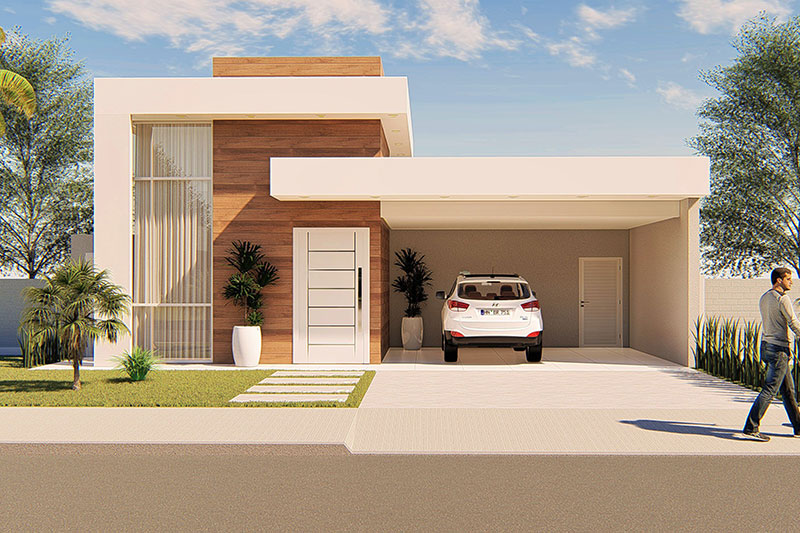

# HCH Inmobiliaria Sonora — Guía de Personalización

## Estructura del proyecto

```
hch-inmobiliaria/
├── index.html              ← Estructura principal
├── css/
│   ├── styles.css          ← Estilos principales
│   └── mediaqueries.css    ← Responsive design
├── js/
│   └── main.js             ← Toda la interactividad
└── assets/
    ├── logoHCH_blanco.png  ← Logo para fondo oscuro
    ├── logoHCH_sin_fondo.png
    ├── hero-bg.jpg         ← [AGREGAR] Foto principal del hero
    ├── about-image.jpg     ← [AGREGAR] Foto de la sección "Nosotros"
    ├── prop1.jpg           ← [AGREGAR] Foto propiedad 1
    ├── prop2.jpg           ← ... y así hasta prop6.jpg
    └── ...
```

---

## Cómo agregar imágenes reales

### Imagen del HERO (fondo principal)
En `css/styles.css`, busca `.hero-bg-placeholder` y reemplaza el `background:` con:
```css
.hero-bg-placeholder {
  position: absolute; inset: 0;
  background-image: url('../assets/hero-bg.jpg');
  background-size: cover;
  background-position: center;
}
```

### Imagen de NOSOTROS
En `css/styles.css`, busca `.about-img-placeholder` y reemplaza el `background:` con:
```css
.about-img-placeholder {
  background-image: url('../assets/about-image.jpg');
  background-size: cover;
  background-position: center;
}
```
Elimina el `::before` si ya no necesitas el texto "Imagen".

### Imágenes de PROPIEDADES (cards)
En `index.html`, en cada `<article class="propiedad-card">`, el elemento `.card-img-placeholder` muestra un color de placeholder. Para usar imagen real, cambia la estructura del `card-img-wrap`:
```html
<div class="card-img-wrap">
  <!-- Reemplaza card-img-placeholder por: -->
  
  <div class="card-overlay">
    <button class="btn-ver-mas">Ver detalles</button>
  </div>
  <div class="card-badge">En Venta</div>
</div>
```

---

## Cómo agregar/editar propiedades

Cada propiedad es un `<article>` en `index.html`. Los datos del popup se leen de los `data-*` attributes:

```html
<article class="propiedad-card"
  data-tipo="casa"                   ← casa | departamento | terreno | comercial
  data-nombre="Nombre de propiedad"
  data-precio="$X,XXX,XXX MXN"
  data-recamaras="4"
  data-banos="3"
  data-m2="320"
  data-estacionamientos="2"
  data-descripcion="Descripción larga..."
  data-ubicacion="Ciudad, Sonora">
```

Para terrenos/locales sin recámaras, usa `data-recamaras="—"`.

---

## Colores de la marca (CSS Variables)

En `css/styles.css` → `:root`:

| Variable       | Color         | Uso                        |
|----------------|---------------|----------------------------|
| `--gold`       | `#C9A84C`     | Acentos, badges            |
| `--gold-light` | `#E8C97A`     | Precios, highlights        |
| `--gold-dark`  | `#8B6914`     | Textos dorados, botones    |
| `--brown`      | `#5A3E1B`     | Fondos oscuros cálidos     |
| `--black`      | `#0F0F0F`     | Fondo secciones oscuras    |
| `--cream`      | `#FAF7F2`     | Fondo secciones claras     |

---

## Contacto / WhatsApp — Actualizar número

En `index.html`, busca:
```html
<a href="https://wa.me/526621234567" ...>
```
Reemplaza `6621234567` con el número real (con lada, sin +).

---

## Formulario de contacto

Actualmente simula el envío. Para conectar con un backend real (EmailJS, Formspree, etc.), en `js/main.js` busca el bloque `// Simulación de envío` y reemplaza con tu llamada real.

### Con Formspree (sin backend):
```html
<form action="https://formspree.io/f/TU_FORM_ID" method="POST">
```

### Con EmailJS:
```js
emailjs.send('SERVICE_ID', 'TEMPLATE_ID', formData);
```

---

## Testimonios — Agregar más

Cada testimonio es un `.testimonio-card` dentro de `#testimoniosTrack`. Los dots se generan automáticamente por JavaScript. Solo agrega más cards y el slider las detecta.

---

## Tips de rendimiento

- Optimiza las imágenes a WebP (max ~200KB por imagen)
- El hero puede ser una imagen comprimida de 1920×1080
- Las cards funcionan bien con imágenes de 800×500
